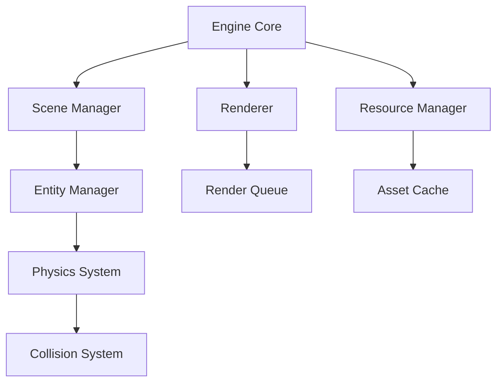

# Quake-like Engine Documentation
## Architecture Overview

### Core Systems Architecture

The engine is built around several key systems that work together:

#### 1. Core Engine
- Manages the game loop and coordinates all subsystems
- Handles initialization and shutdown sequences
- Provides access to all major subsystems through a singleton pattern
- Controls frame timing and delta time calculations

#### 2. Window Management
- Creates and manages the OpenGL context
- Handles window events and resizing
- Manages input events from keyboard and mouse
- Provides platform abstraction layer

#### 3. Resource Management
- Loads and caches textures, models, sounds, and shaders
- Implements reference counting for automatic resource cleanup
- Handles asynchronous resource loading
- Manages memory budgets for different resource types

#### 4. Scene Management
- Maintains scene graph hierarchy
- Handles entity creation and destruction
- Manages scene transitions
- Controls scene serialization and deserialization

### Data Flow

### Engine Lifecycle
1. **Initialization**
   - Load configuration
   - Initialize subsystems
   - Create window and OpenGL context
   - Load default resources

2. **Main Loop**
   - Process input
   - Update physics
   - Update game logic
   - Render frame
   - Swap buffers

3. **Shutdown**
   - Save state
   - Release resources
   - Cleanup subsystems
   - Close window

### Error Handling
- Uses exception handling for initialization errors
- Implements logging system for debugging
- Provides error callbacks for critical systems
- Maintains error state tracking

### Threading Model
- Main thread: Game logic and OpenGL calls
- Resource loading thread: Async asset loading
- Physics thread: Collision detection and resolution
- Audio thread: Sound processing and playback